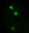
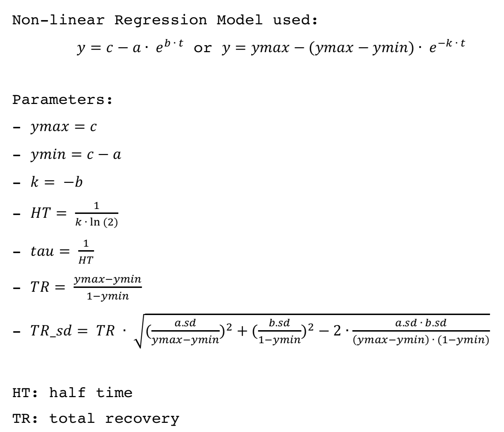
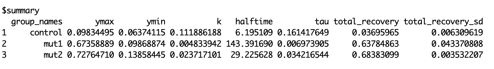
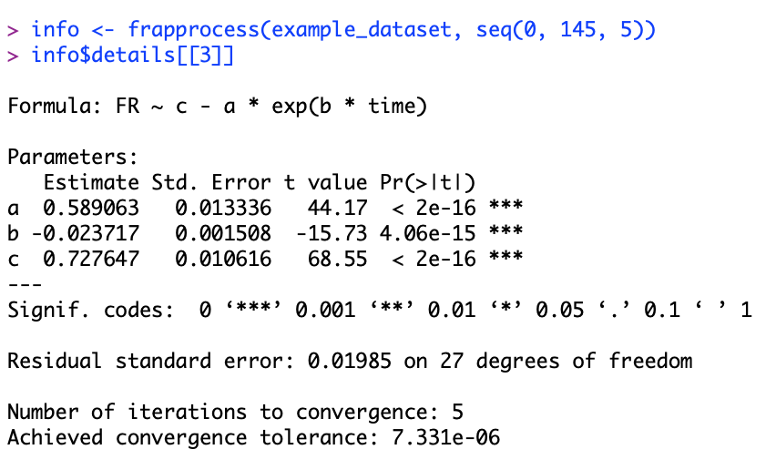
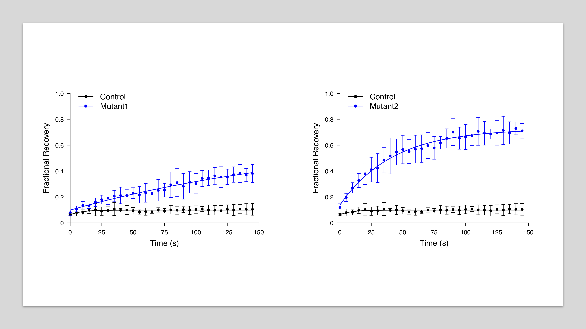

# Automatic Data Processing and Visualization for FRAP

[](https://opensource.org/licenses/MIT)
[](https://travis-ci.org/GuanqiaoDing/frapplot)

This R package aims to automatically process Fluorescence Recovery After Photobleaching (FRAP) data and generate consistent, publishable figures. The automation would bring down the hour-long routine work to a few seconds for researchers that often do FRAP experiments. Note: this package does not replace ['ImageJ'](https://imagej.nih.gov/ij/) (or other image quantification tools) in raw image quantification.

## Method

FRAP image courtesy of [Dr. Michael Rosen's Lab](https://www.utsouthwestern.edu/labs/rosen/):



(The top-left puncta is the targeted area.)



## Features

- Batch calculations and regressions for all the groups from the dataset and summarize the results by group names in a dataframe:



- Access details about the regression of individual groups by simple indexing:



- Generate figures in a consistent and publishable format:



- Compare results of any two groups with a single command.

- Have tested with a real-world dataset from a FRAP experiment.

## Install

```R
# if "devtools" has not been installed
install.packages("devtools")

# install and load frapplot
devtools::install_github("GuanqiaoDing/frapplot")
library(frapplot)

# bring up the manual
?frapprocess
?frapplot
```

## Usage

Example use of frapprocess and frapplot:

```R
# after the preprocessing (refer to ./data-raw/preprocess.R)
load("data/example_dataset.rda")
info <- frapprocess(example_dataset, seq(0, 145, 5))

# view results
info$summary
info$details

# plot any two groups as desired
frapplot ("Control", "Mutant1", info)
frapplot ("Control", "Mutant2", info)
```

Note:

- Raw data can either be in a single file or separate files, refer to [preprocess.R](./data-raw/preprocess.R) for more information.

- Make sure the names (case-sensitive) you provide to `frapplot()` are correct;

- Make sure "info" (the third argument) remains in your global environment and refers to the same experiment before you run `frapplot()`, otherwise re-run `frapprocess()` and get its return value.

## Outputs

`frapplot()` returns a list (if assigned to variable "info"):

- info$time_points: a vector of time points

- info$summary: a dataframe showing the summary of the regression including ymax, ymin, k, halftime, tau, total_recovery, total_recovery_sd.

- info$sample_means: a matrix of sample means, nrow = num of time points, ncol = sample size

- info$sample_sd: a matrix of standard deviations, nrow = num of time points, ncol = sample size

- info$model: a list of models for each group from the non-linear regression

- info$details: details of the regression for each group

`frapplot()` generates a pdf file that compares two groups of choice.

## Test with An Example Dataset

An example dataset can be found [here](./data-raw), which is courtesy of [Dr. Michael Rosen's Lab](https://www.utsouthwestern.edu/labs/rosen/) and should never be used for other purposes.

The [preprocessing](./data-raw/preprocess.R) generates ".rda" file that is ready to be loaded. The code has been tested with the example dataset and generates [expected results](./data-output). Note that only five samples are included in each group of this dataset for demonstration, but larger sample size is highly recommended for statistical robustness.

The code has also passed R CMD check.

## Report Issues

Please report any bugs or issues [here](https://github.com/GuanqiaoDing/frapplot/issues/new). The project also welcomes your contribution.

## License

`frapplot` is licensed under the MIT License - see [LICENSE](./LICENSE) for the details.

## Acknowledgements

I truly appreciate the help and resources provided by [Dr. Michael Rosen's Lab](https://www.utsouthwestern.edu/labs/rosen/) at UT Southwestern Medical Center for this project.
