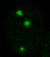
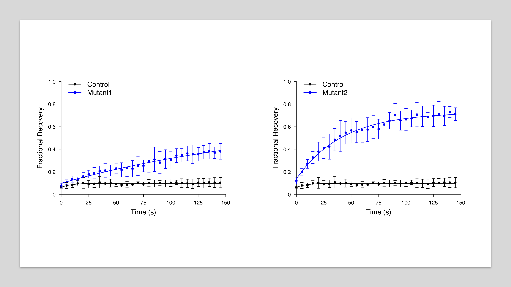

# Automatic Data Processing and Visualization for FRAP
[](https://opensource.org/licenses/MIT)

This R package aims to automatically process Fluorescence Recovery After Photobleaching (FRAP) data and generate consistent, publishable figures. The automation would bring down the hour-long routine work to a few seconds for researchers that often do FRAP experiments. Note: this package does not replace ['ImageJ'](https://imagej.nih.gov/ij/) (or other image quantification tools) in raw image quantification.

FRAP image courtesy of [Dr. Michael Rosen's Lab](https://www.utsouthwestern.edu/labs/rosen/): <br/>
 <br/>
(The top-left puncta is the targeted area.)

Generates consistent high-resolution figures that are publishable: <br/>
 <br/>
[Full size files](./data/example/output)

## Installation
In the R or Rstudio console,
```
\# if "devtools" has not been installed
install.packages("devtools")

\# install and load frapplot
devtools::install_github("GuanqiaoDing/frapplot")
library(frapplot)

\# bring up the manual
?frapprocess				
?frapplot
```

## Usage
Please use the following guidelines to prepare data before running frapplot (it is arguably a good practice even without use of frapplot):
- Make a main folder for the experiment (rawdata directory);
- Each group (e.g. control, mutant1, mutant2, etc.) has its own subfolder, the number of groups is not restricted;
- Quantify the fluorecent intensity at the bleach targeted area by ['ImageJ'](https://imagej.nih.gov/ij/) (or other image quantification tools), and export the result to a '.txt' file (name does not matter). The first value (usually from the first image of the time-lapse) is the intensity before the bleach, which is followed by the time-lapse values after the bleach;
- In this way, you will have multiple files in each subfolder where the number of the files equals to sample size (size not restricted).

In the R or Rstudio console:
```
\# example use of frapprocess and frapplot

\# the second argument time_points is a vector that specifies the time points of the time-lapse experiment **after** the bleach starting at 0
info <- frapprocess (rawdata_dir =  "~/myproject/experiment1/rawdata", time_points = seq(0, 145, 5))

\# plot any combinations of groups as desired
frapplot ("Control", "Mutant1", info)
frapplot ("Control", "Mutant2", info)
```

Note:
- Make sure the path of the rawdata directory is correct;
- Make sure the names (case-sensitive) you provided to `frapplot()` is correct;
- Make sure "info" remains in your global environment and refers to the same experiment before you run `frapplot()`, otherwise re-run `frapprocess()` and get its return value.

## Outputs
`frapprocess()` generates following files in the "output" folder (sibling to rawdata folder):
- Normalized data for each group (number of columes = sample size). The intensity value before the bleach is always "1" after normalization and removed since it is not used for plot;
- Summarized sample means;
- Summarized sample standard deviation;
- Summarized parameters and results: ymax, ymin, k, halftime, tau, total_recovery, total_recovery_sd.

`frapplot()` generates a pdf file that compares two groups of choice.

## Test with Example Dataset
An example dataset can be found [here](./data/example/rawdata), which is courtesy of [Dr. Michael Rosen's Lab](https://www.utsouthwestern.edu/labs/rosen/) and should never be used for other purposes.

The code has been tested with the example dataset. Its outputs are as expected and can be found [here](./data/example/output). Note that only five samples are included in each group of this dataset for demonstration, but larger sample size is highly recommended for statistical robustness.

The code has also passed R CMD check.

## Report Issues
Please report any bugs or issues [here](https://github.com/GuanqiaoDing/frapplot/issues/new). The project also welcomes your contribution.

## License
`frapplot` is licensed under the MIT License - see [LICENSE](./LICENSE) for the details.

## Acknowledgements
I truly appreciate the help and resources provided by [Dr. Michael Rosen's Lab](https://www.utsouthwestern.edu/labs/rosen/) at UT Southwestern Medical Center for this project.
